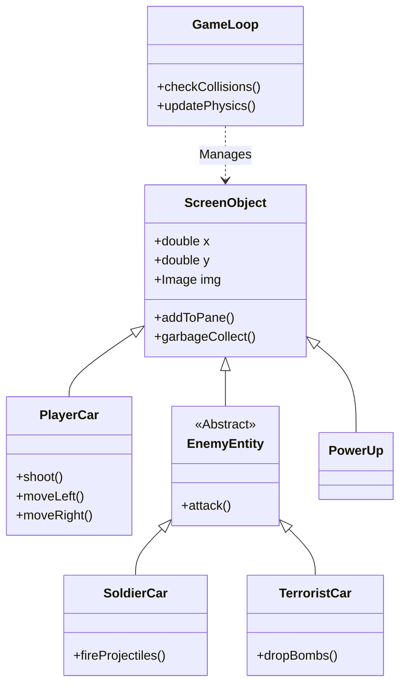

<!-- CHUNK 1 START -->

<!-- 
  SEO KEYWORDS: JavaFX Racing Game, Java 21 Game Development, OOP Design Patterns, 
  Open Source Car Game, Maven Project Structure, 2D Survival Racer
-->

<div align="center">
 
  <!-- HERO BANNER: Dynamic Capsule Render with Gradient -->
  

  <!-- ANIMATED SUBTITLE: Typing SVG for Value Propositions -->
  <a href="https://github.com/amir-hossein-khodaei/javafx-racing-game">
    
  </a>

  <!-- BADGES: High-Value Metadata -->
  <p>
    <a href="https://github.com/amir-hossein-khodaei/javafx-racing-game/graphs/contributors">
      
    </a>
    <a href="https://github.com/amir-hossein-khodaei/javafx-racing-game/network/members">
      
    </a>
    <a href="https://github.com/amir-hossein-khodaei/javafx-racing-game/stargazers">
      
    </a>
    <a href="https://github.com/amir-hossein-khodaei/javafx-racing-game/issues">
      
    </a>
    <a href="https://github.com/amir-hossein-khodaei/javafx-racing-game/blob/main/LICENSE">
      
    </a>
  </p>

  <br />

  <!-- ACTION BUTTONS -->
  <p>
    <a href="#getting-started">
      
    </a>
    &nbsp;
    <a href="https://github.com/amir-hossein-khodaei/javafx-racing-game/releases">
      
    </a>
  </p>
</div>

<br />

---

## 📋 Table of Contents

<details>
<summary>Click to expand</summary>

1. [About The Project](#-about-the-project)
    - [Key Features](#key-features)
    - [Built With](#built-with)
2. [Demo & Visuals](#-demo--visuals)
    - [Screenshots](#screenshots)
    - [Architecture](#architecture)
3. [Getting Started](#-getting-started)
    - [Prerequisites](#prerequisites)
    - [Installation](#installation)
4. [Usage](#-usage)
    - [Controls](#controls)
    - [Game Mechanics](#game-mechanics)
5. [Roadmap](#-roadmap)
6. [Contributing](#-contributing)
7. [License](#-license)
8. [Contact & Acknowledgments](#-contact--acknowledgments)

</details>

---

## 🏎️ About The Project

**Racing Game** (internal codename `GTA_VI`) is a high-speed, vertical-scrolling survival racer built entirely in **Java 21** and **JavaFX**. Designed as a comprehensive showcase of **Object-Oriented Programming (OOP)** principles, this project demonstrates how to architect a real-time game loop, manage complex entity states, and handle collision detection without relying on heavy game engines like Unity or Godot.

In this adrenaline-fueled chase, players take the wheel of a high-performance vehicle on a relentless highway. The mission is simple but deadly: survive as long as possible while dodging military convoys, evading terrorist bombers, and managing critical resources like fuel and vehicle integrity.

### Key Features

*   **Advanced OOP Architecture**: Clean separation of concerns using inheritance and polymorphism for entity management (`SoldierCar`, `TerroristCar`, `NormalCar` all extending `ScreenObject`).
*   **Dynamic Enemy AI**: three distinct enemy classes with unique behaviors—some block your path, while others actively fire projectiles or drop explosives.
*   **Resource Management System**: Strategic gameplay requiring players to balance speed with fuel consumption (`Gas`) and hull integrity (`Heart`).
*   **Persisted High Scores**: A custom flat-file database system that tracks player performance, login timestamps, and historical run data across sessions.
*   **Modular UI**: Built with JavaFX FXML for a separation of layout and logic, featuring animated menus, rainy weather effects, and responsive HUDs.

### Built With

This project leverages a modern Java ecosystem to deliver a performant desktop experience:

| Tech | Badge | Description |
|:---:|:---|:---|
| **Language** |  | Core logic and game loop execution. |
| **Framework** |  | Hardware-accelerated GUI toolkit for rendering. |
| **Build Tool** |  | Dependency management and build lifecycle. |
| **UI Libs** |  | Enhanced UI controls and dialogs. |
| **Format** |  | XML-based user interface markup. |


<!-- CHUNK 2 START -->

## 🎥 Demo & Visuals

Experience the intense action of the Racing Game. The interface features dynamic weather effects (rain), animated enemy sprites, and a real-time HUD.

### Screenshots

<div align="center">
  <table>
    <tr>
      <td align="center">
        
        <br />
        <em>Main Menu & Player Selection</em>
      </td>
      <td align="center">
        
        <br />
        <em>High-Speed Highway Pursuit</em>
      </td>
    </tr>
    <tr>
      <td align="center">
        
        <br />
        <em>Combat & Obstacle Evasion</em>
      </td>
      <td align="center">
        
        <br />
        <em>Persistent Leaderboards</em>
      </td>
    </tr>
  </table>
</div>

### Architecture

The game is built on a robust **Object-Oriented** foundation. All moving entities inherit from a central `ScreenObject` class, ensuring consistent rendering and collision logic.



---

## 🚀 Getting Started

Follow these steps to get a local copy up and running. This project is built with **Maven**, ensuring dependency management is automated.

### Prerequisites

*   **Java Development Kit (JDK) 21** or higher.
    *   *Verify with:* `java -version`
*   **Git** (to clone the repository).
*   **Maven** (optional, as the project includes a wrapper).

### Installation

1.  **Clone the repository**
    ```bash
    git clone https://github.com/amir-hossein-khodaei/javafx-racing-game.git
    cd javafx-racing-game
    ```

2.  **Initialize the Wrapper & Build**
    Use the included Maven Wrapper (`mvnw`) to ensure the correct Maven version is used.
    
    *   **Windows:**
        ```powershell
        ./mvnw.cmd clean install
        ```
    *   **Mac/Linux:**
        ```bash
        chmod +x mvnw
        ./mvnw clean install
        ```

3.  **Run the Game**
    Launch the application directly via the JavaFX Maven plugin:
    ```bash
    # Windows
    ./mvnw.cmd javafx:run

    # Mac/Linux
    ./mvnw javafx:run
    ```

---

## 🎮 Usage

Once the game launches, you will be prompted to **Sign Up** or **Log In**. The game saves your progress locally in `.txt` files, tracking your high scores across sessions.

### Controls

| Action | Key / Input | Description |
| :--- | :---: | :--- |
| **Steer Left** | <kbd>A</kbd> | Move vehicle to the left lane. |
| **Steer Right** | <kbd>D</kbd> | Move vehicle to the right lane. |
| **Fire Weapon** | <kbd>Left Click</kbd> | Shoot projectiles at enemies ahead. |
| **Menu Nav** | <kbd>Mouse</kbd> | Click to select options in menus. |

### Game Mechanics

Your survival depends on managing three core resources displayed on the HUD:

1.  **❤️ Health (Heart Bar)**: Depletes when you collide with enemies or get hit by enemy fire.
    *   *Recover:* Collect **Heart** power-ups.
    *   *Critical:* Hitting 0 ends the run.

2.  **⛽ Fuel (Gas Bar)**: Constantly drains as you drive.
    *   *Recover:* Collect **Gas Can** items.
    *   *Critical:* Running out of fuel stops the car and ends the game.

3.  **🛡️ Power-Ups**:
    *   **Shield**: Temporary invincibility.
    *   **Speed Boost**: Short burst of acceleration (increases score multiplier).
    *   **Ammo**: Replenishes projectile count for your weapon.


<!-- CHUNK 3 START -->

## 🗺️ Roadmap

- [x] **Core Mechanics**: Collision detection, shooting, and enemy spawning.
- [x] **Persistence**: Player profiles and high-score saving via local storage.
- [x] **Visuals**: Dynamic weather (rain), animated sprites, and scrolling backgrounds.
- [ ] **Sound Settings**: Add volume sliders for SFX and Music in the pause menu.
- [ ] **Executable Packaging**: Bundle with `jpackage` for a standalone `.exe` or `.dmg`.
- [ ] **Refactoring**: Migrate from flat-file storage to SQLite for robust data management.

See the [open issues](https://github.com/amir-hossein-khodaei/javafx-racing-game/issues) for a full list of proposed features (and known issues).

---

## 🤝 Contributing

Contributions are what make the open source community such an amazing place to learn, inspire, and create. Any contributions you make are **greatly appreciated**.

1.  **Fork the Project**
2.  **Create your Feature Branch** (`git checkout -b feature/AmazingFeature`)
3.  **Commit your Changes** (`git commit -m 'Add some AmazingFeature'`)
4.  **Push to the Branch** (`git push origin feature/AmazingFeature`)
5.  **Open a Pull Request**

### Top Contribution Ideas
*   *Asset Swap*: Replace placeholder sprites with custom pixel art.
*   *New Enemies*: Create a new class extending `EnemyEntity`.
*   *Optimization*: Improve the garbage collection logic in `ScreenObject`.

---

## 📝 License

Distributed under the **MIT License**. See `LICENSE` for more information.

This project is open-source and free to use. You can copy, modify, merge, publish, distribute, sublicense, and/or sell copies of the Software.

---

## 👏 Acknowledgments

This project wouldn't be possible without the inspiration and assets from the following sources:

*   **Gran Turismo**: For the iconic audio tracks that fuel the racing atmosphere.
*   **Must Deliver**: The primary inspiration for the vertical scrolling map design.
*   **Pinterest & Generative AI**: Various sprite assets and background textures.
*   **OpenJFX Community**: For the robust documentation on JavaFX modularity.


<div align="center">
  
</div>